# Testing Sakha Dispatcher (Web App)

1. Start the VPN

2. Open http://10.8.0.8/sakhadispatcher/ 
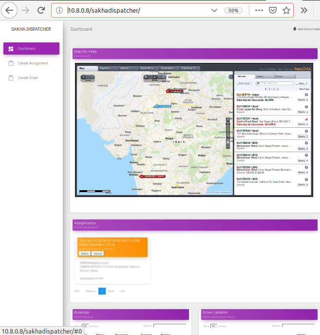
3. You can see the latest updates by sorting by different columns 
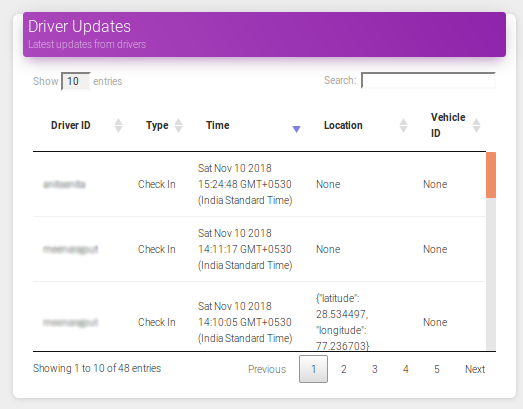

4. To create a new assignment (i.e. to assign a job to a driver), use the "Create Assignment" buton on the left. A booking is selected when it is highlighted. To assign a driver to a vehicle, select the driver so that the row is highlighter, and then click the vehicle column in the selected row to pick the vehicle. Save the assignment by clicking the "Save Assignment" button at bottom left. 
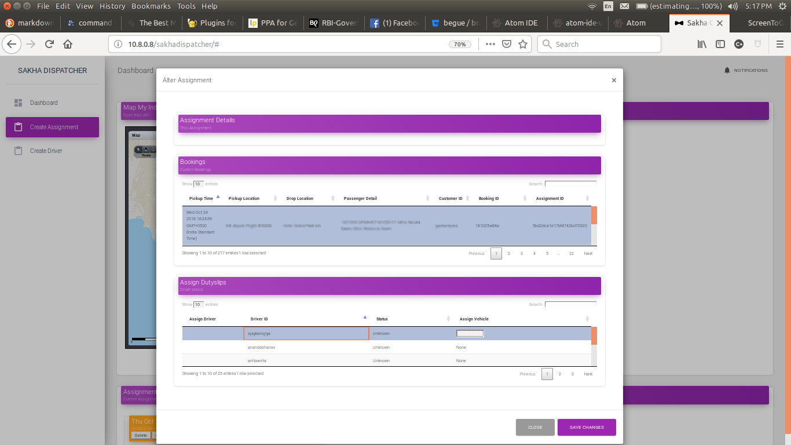

5. To add a new driver record, use the "Create Driver" button on the left. If the new driver is added successfully, you will see the status updated in green ("Success"). If a driver exists with the same ID, the system will generate an error in red ("The is already a Driver with that ID")
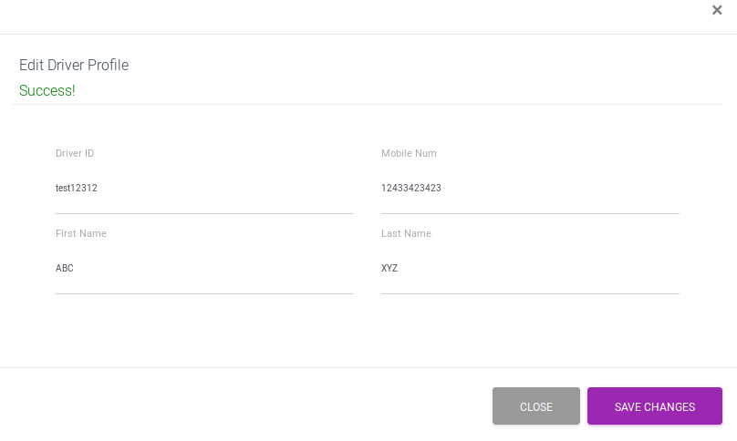
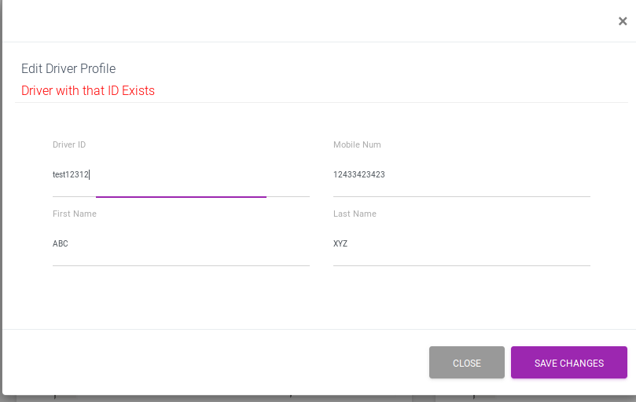

6. To edit an existing driver, click the clipboard icon next to their name in the Driver Status pane

# Testing Sakha Driver Assistant (Telegram Bot)

1. You must be registered via the "Create Driver" workflow above or via the API to use the bot
2. Open the bot chat and type "/start". You will get the main menu. 
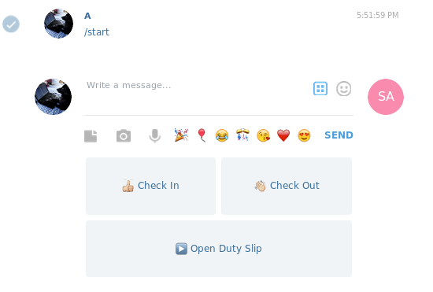
3. To submit a location update, click "Check In" or "Check Out". You will get the location update menu
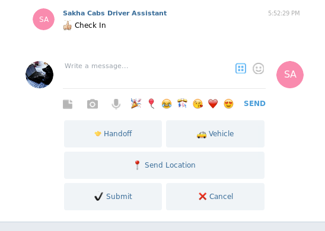
4. If you want to add a location, click "Send Location". Click the "Send Location" button and agree to provide the location. 
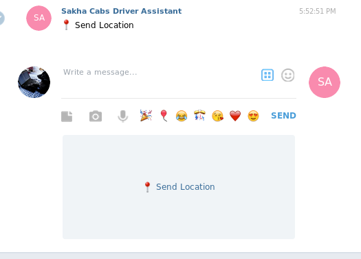
5. If the location is sent successfully, it will be included in the reply as a lat/long string -
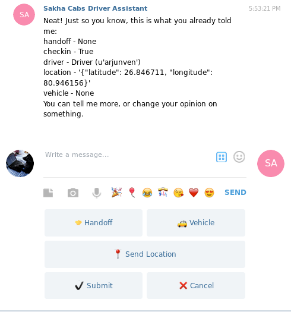
6. To add a vehicle to your location update, click the "Vehicle" button and provide the Vehicle ID (the registration number, no spaces, all caps as in the MMI console). If the Vehicle is successfully added, it will be included in the reply, else the "vehicle -" section will read "None"
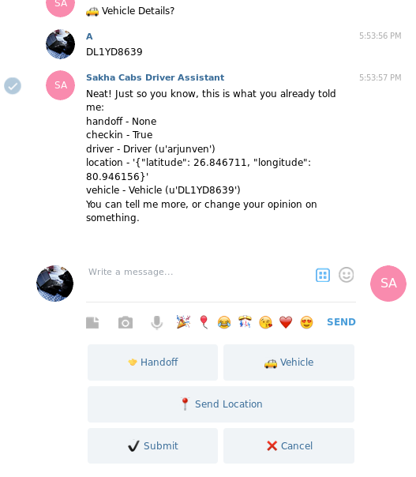
7. To submit the location update, click the "Submit" button. If the location update is saved successfully you will see the following message - 
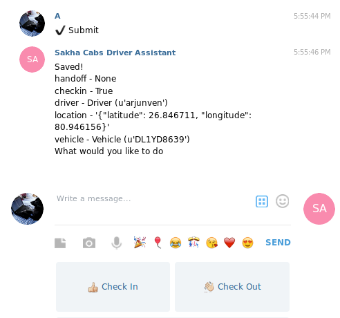
8. To open existing assigned trips, click "Open Duty Slip" in the main menu. You will get a list of assigned duty slips, with the ID and pickup time
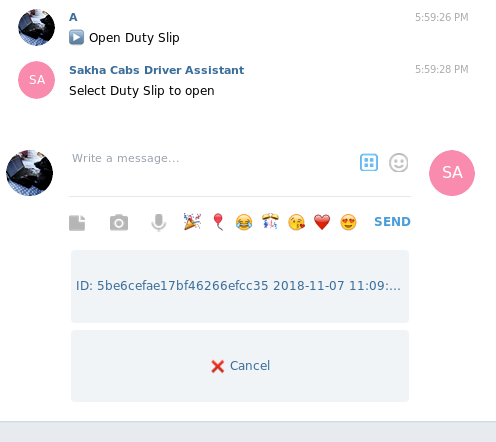
9. Select the trip you want to open. You will get the option to start the trip

10. When the trip is started, additional details will be asked for like Open KMS and Duty Slip number. Once these are provided, the trip is in progress. To stop the trip, click the "Stop Duty" button

11. At the time of closing the duty, the Close KMs and Amount collected (if any, else 0) needs to be provided. Click Submit to close the trip. 
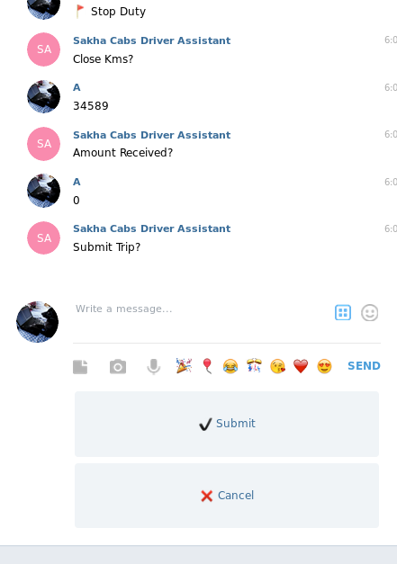
12. If the trip is closed successfully you will get a message as follows - 
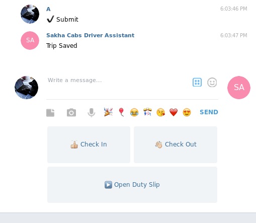

